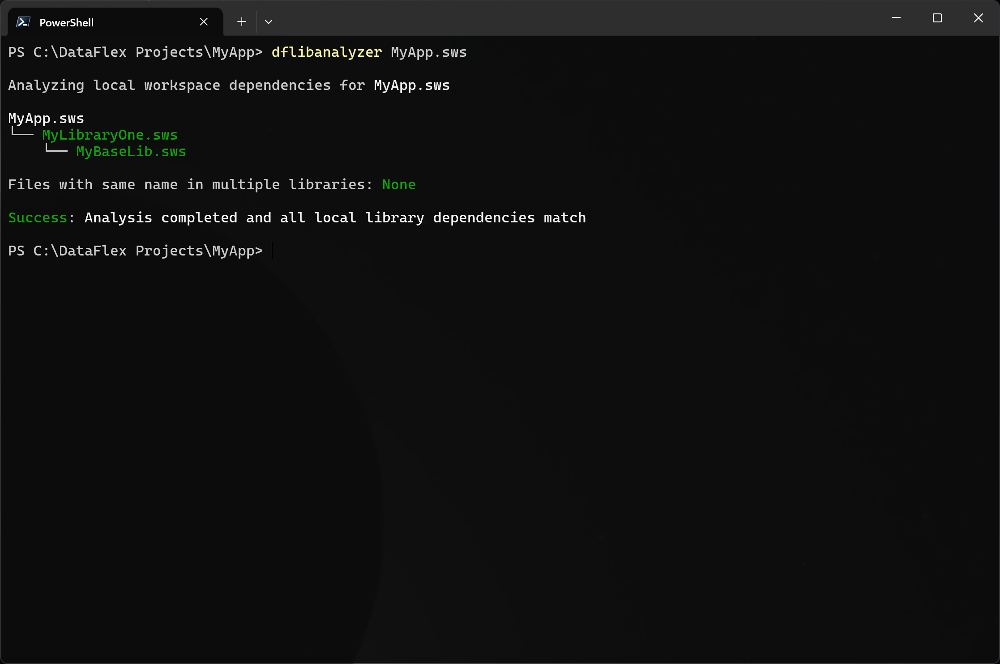
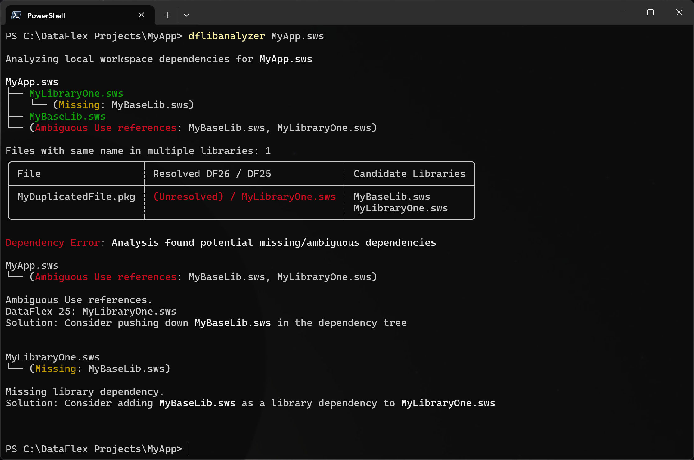

# DataFlex Workspace Library Dependency Analyzer

This command line tool analyzes DataFlex source files in a workspace, and displays the implicit library dependencies.
It identifies missing or ambiguous library dependencies based on the actual `Use` statements in source files,
and suggests `.sws` file updates accordingly.

## Installing

You can install the latest pre-built binary release from https://github.com/sonnyfalk/dflibanalyzer/releases.

## Usage

```
Usage: dflibanalyzer.exe [OPTIONS] <SWS_FILE>

Arguments:
  <SWS_FILE>

Options:
  -v, --verbose
  -r, --recursive-scan  Scan source files in AppSrc/DdSrc recursively
  -h, --help            Print help
```

## Examples

#### Example workspace with expected dependency tree



#### Example workspace with file conflicts and ambiguous Use reference


